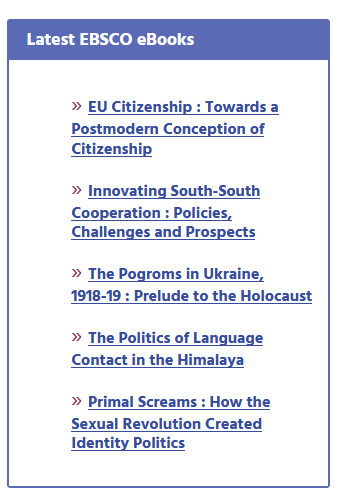

# Reserach Guides
A place to gather best practices

* [Example Guide to draw upon for Ro](https://ulib.iupui.edu/guides/libguides-best-practices)

# Guide Parts

# I. Intro Statement
Note: Not a heading level.  Examples:
* **Objective:** To support the research needs of  Whatcom students in the [Nursing](http://whatcom.edu/academics/degrees-certificates/nursing) program.
* **Purpose:** Philosophy is a major academic field that covers many topics. WCC offers several courses on philosophy including Critical Thinking, Logic, Ethics and Religion. This guide is meant to help students find the best research sources both within the libraries collection and on the open web.

When in a Tabbed Area, can be under the H2 tab title "Introduction"
* Political Science is the study of systems of government, politics, and power. WCC offers courses on Political Science including Political Theory, American Governement, International Relations, and Comparative Government. This guide is meant to help students find the best sources for both within the libraries collection and on the open web, as well as resources for keeping current on political news and events. [see here](http://librarywp.whatcom.edu/home/polisci/)

# II. pBooks
 ## Browse the Stacks
* Stacks range
    * Simple - use [dropcap]##[/dropcap] (max 2 letters).
    * Complex - use [spoiler][/spoiler]
    * Combo - [see example](http://librarywp.whatcom.edu/home/polisci/)

## Print magazines
* Use if there is a small sample.  For example
"Browse & read in the library! Title include ARTnews, Art in America & Woman's Art Journal"
 
## Streaming Media
* FOD categories
* Ted Talk Categories
* Anything else?

## Box: Journals 
* Use [A-Z Journals]
* Still can't find a particular article? Request articles through [Interlibrary Loan](http://library.whatcom.edu/services/interlibrary-loan)
### In Print @ the Library
* Picture of mags and list and link to online version if exists.
[pic of box](

# IV. Featured Databases (if exists)
Featured Database
[row][column size="1/3"][pods name="authenticated_databa" slug="cmmc" template="Authdbs Logo (full) with Link"][/column]
[column size="2/3"][pods name="authenticated_databa" slug="cmmc" template="AuthDbs - Single Line (wcc logo)"][/column][/row]

# V. eBooks
RSS Feed

# Database Training & Orientation Videos - Put these in "auth_dbs" posts.
* eLibrary Training Video 
*	eLibrary Curriculum Edition 2-Minute Video 
*	History Study Center Training Video 
*	History Study Center 2-Minute Overview 
*	ProQuest Learning: Literature Training Video 
*	SIRS Discoverer Full Training 
*	CultureGrams 4-Minute Overview 
